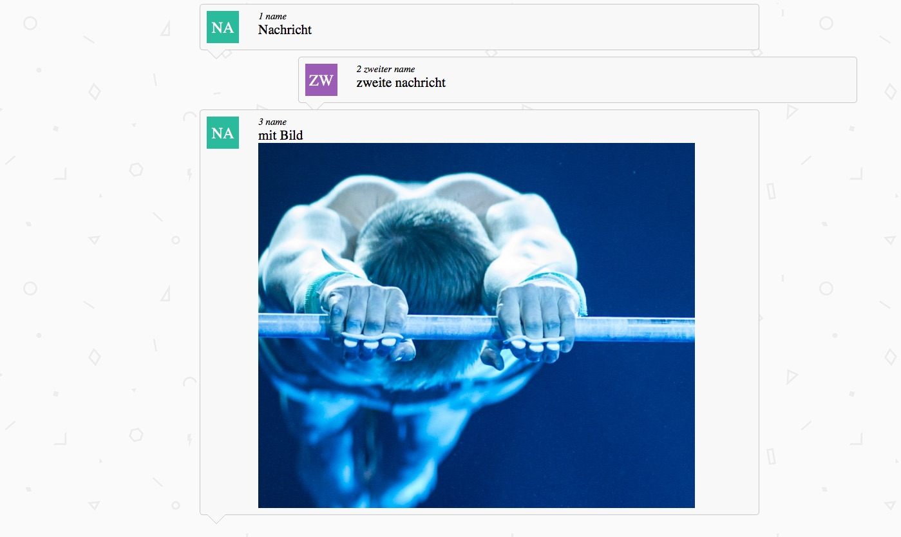
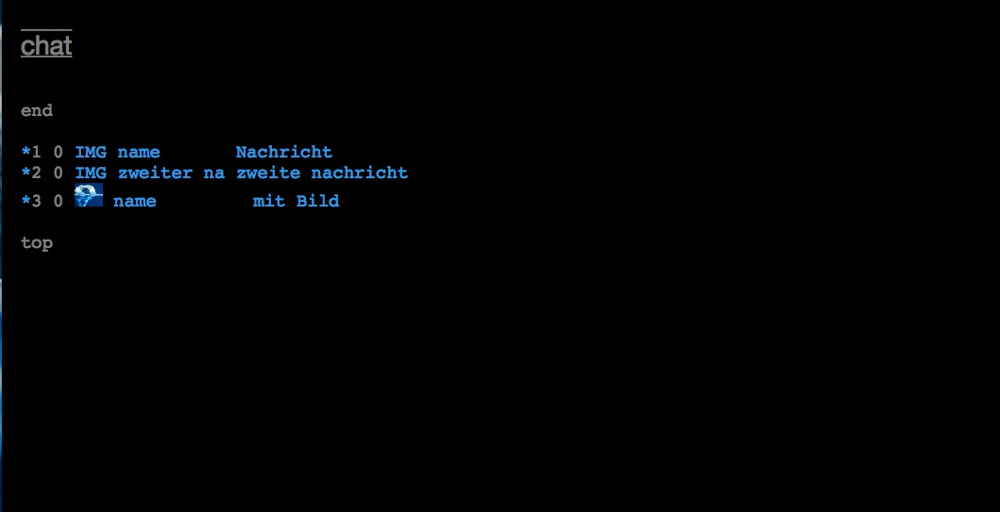

# projector.chat

let your audience chat live  
works well with https://github.com/under-score/projector  
does threading, uses initals, allows preview 

  

seven easy steps for setup:
1. move this project to a subdirectory of the projector app or wherever you need it
2. create a cache subdirectory if you want picture attachments
3. standard set up is admin preview before "publication". can be changed in client.php
4. point your admin browser to http://x.x.x.x/projector/projector.chat/admin.php During first time run a database will be created 
5. point your display browser to http://x.x.x.x/projector/projector.chat/chat.php  
6. let the users enter their messages at http://x.x.x.x/projecor/projector.vote/client.php  
7. whenever there is a new message in admin.php, change it from 0 to 1 to display it

  
